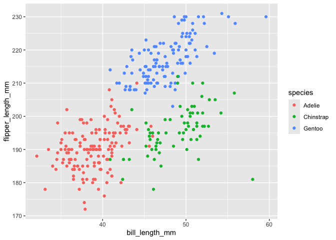

HW1
================
2024-09-21

### Problem 1

Write a short description of the penguins dataset (not the penguins_raw
dataset) using inline R code. In your discussion, please include: the
data in this dataset, including names / values of important variables
the size of the dataset (using nrow and ncol ) the mean flipper length
Make a scatterplot of flipper_length_mm (y) vs bill_length_mm (x); color
points using the species variable (adding color = … inside of aes in
your ggplot code should help). Export your first scatterplot to your
project directory using ggsave.

``` r
library("tidyverse")
```

    ## ── Attaching core tidyverse packages ──────────────────────── tidyverse 2.0.0 ──
    ## ✔ dplyr     1.1.4     ✔ readr     2.1.5
    ## ✔ forcats   1.0.0     ✔ stringr   1.5.1
    ## ✔ ggplot2   3.5.1     ✔ tibble    3.2.1
    ## ✔ lubridate 1.9.3     ✔ tidyr     1.3.1
    ## ✔ purrr     1.0.2     
    ## ── Conflicts ────────────────────────────────────────── tidyverse_conflicts() ──
    ## ✖ dplyr::filter() masks stats::filter()
    ## ✖ dplyr::lag()    masks stats::lag()
    ## ℹ Use the conflicted package (<http://conflicted.r-lib.org/>) to force all conflicts to become errors

``` r
library("palmerpenguins")

data("penguins", package = "palmerpenguins")
p1_df_a <- tibble(penguins)
p1_df_b <- drop_na(p1_df_a)
```

### Description

Rows with NA in Penguins dataset are removed.

The number of rows and columns in the Penguins dataset are : **333, 8**

Column names of the dataset are: **species, island, bill_length_mm,
bill_depth_mm, flipper_length_mm, body_mass_g, sex, year**

Types of penguin species of the dataset are: **Adelie, Chinstrap,
Gentoo**

Types of islands of the dataset are: **Biscoe, Dream, Torgersen**

Levels of Sex of the dataset are: **female, male**

Years listed in the dataset are: **2007, 2008, 2009**

Mean of flipper length in mm is: **200.97**

Mean of bill length in mm is: **43.99**

Mean of bill depth in mm is: **17.16**

Mean of body mass in g is: **4207.06**

### Plot

``` r
ggplot(p1_df_b, aes(x = bill_length_mm, y = flipper_length_mm, color=species)) + geom_point()
```

<!-- -->

``` r
ggsave("plot_hw1_p1.pdf", height = 4, width = 6)
```

### Problem 2:

Create a data frame comprised of: a random sample of size 10 from a
standard Normal distribution. a logical vector indicating whether
elements of the sample are greater than 0 a character vector of length
10 a factor vector of length 10, with 3 different factor “levels”

Try to take the mean of each variable in your dataframe. What works and
what doesn’t?

Hint: to take the mean of a variable in a dataframe, you need to pull
the variable out of the dataframe. Try loading the tidyverse and using
the pull function.

In some cases, you can explicitly convert variables from one type to
another. Write a code chunk that applies the as.numeric function to the
logical, character, and factor variables (please show this chunk but not
the output). What happens, and why? Does this help explain what happens
when you try to take the mean?

``` r
library(tidyverse)
```

``` r
set.seed(1)

p2_df <- tibble(
  norm_samp = rnorm(10, mean = 0, sd = 1),
  log_vec = norm_samp > 0,
  char_vec = c("Alpha", "Bravo", "Charlie", "Delta", "Echo",
                "Foxtrot","Golf","Hotel","India","Juliet"),
  factor_vec = factor(c("He","She","They","She","They",
                         "They","He","She","She","He"))
)

p2_df
```

    ## # A tibble: 10 × 4
    ##    norm_samp log_vec char_vec factor_vec
    ##        <dbl> <lgl>   <chr>    <fct>     
    ##  1    -0.626 FALSE   Alpha    He        
    ##  2     0.184 TRUE    Bravo    She       
    ##  3    -0.836 FALSE   Charlie  They      
    ##  4     1.60  TRUE    Delta    She       
    ##  5     0.330 TRUE    Echo     They      
    ##  6    -0.820 FALSE   Foxtrot  They      
    ##  7     0.487 TRUE    Golf     He        
    ##  8     0.738 TRUE    Hotel    She       
    ##  9     0.576 TRUE    India    She       
    ## 10    -0.305 FALSE   Juliet   He

### Checking the class of the variables:

The variable `norm_samp` has class numeric

The variable `log_vec` has class logical

The variable `char_vec` has class character

The variable `factor_vec` has class factor

### Find the mean of the variables:

The variable `norm_samp` has mean 0.1322028

The variable `log_vec` has mean 0.6

The variable `char_vec` has mean NA

The variable `factor_vec` has mean NA

The mean function works for numeric and logical classes, but not for
character and factor classes.

### Convert logical, character and factor classes to numeric class.

``` r
new_log <- as.numeric(p2_df$log_vec)
new_char <- as.numeric(p2_df$char_vec)
```

    ## Warning: NAs introduced by coercion

``` r
new_factor <- as.numeric(p2_df$factor_vec)
```

Logical vector converted from “TRUE” and “FALSE” to numeric vector “1”
and “0”. Therefore, mean function works on a new logical vector.

Character vector failed to convert to numeric, instead NAs are
generated. Therefore, mean function does not work on a new character
vector.

Factor vector converted from “He”, “She”, “They” to “1”, “2”, “3”.
Therefore, mean function works on a new factor vector.
